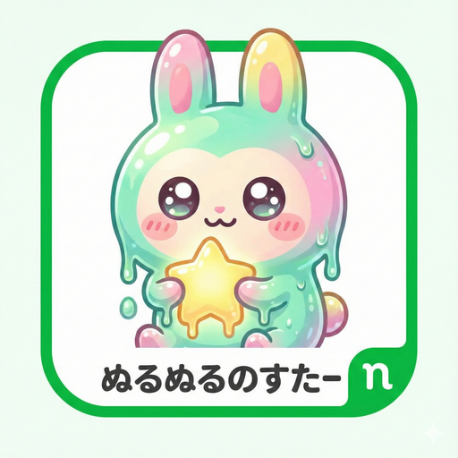

# ぬるぬる — null--nostr

<p align="center">
  
</p>

<p align="center">
  LINE風のデザインで使えるNostrクライアント
  <br />
  <a href="https://github.com/tami1A84/null--nostr/releases/latest">
    
  </a>
  
  
</p>

---

## 日本語

### ぬるぬるとは

「ぬるぬる」はNostrプロトコル向けのクライアントアプリです。LINEのような使い慣れたチャット画面で、分散型ソーシャルネットワーク「Nostr」を体験できます。

Nostrは、特定の企業やサーバーに依存しない自由なSNSプロトコルです。アカウントは暗号鍵で管理され、サービスに縛られません。ぬるぬるはその入り口を、できるだけシンプルにすることを目指しています。

### 主な機能

**タイムライン**
- おすすめとフォロー中を切り替えて表示
- アルゴリズムによる推奨フィード（フォロワーネットワーク + エンゲージメント）
- 画像・カスタム絵文字・ループ動画（NIP-71）に対応

**動画投稿**
- 最大6.3秒のループ動画を撮影・投稿
- ProofMode対応: PGP署名とフレームハッシュで動画の真正性を証明
- タップで音声のミュート解除

**トーク（DM）**
- NIP-17/44/59 に基づく暗号化プライベートメッセージ
- LINE風のチャット画面

**セキュリティ**
- パスキーログイン（パスワード不要）
- 外部署名アプリ（Amber等）対応
- 秘密鍵はデバイス内に安全に保管

**ミニアプリ**
- カスタム絵文字、プロフィールバッジ、スケジュール調整など
- 外部WebアプリをNostrセッション付きで起動

### インストール

**Android（推奨）**

[Releases](https://github.com/tami1A84/null--nostr/releases/latest) から最新の `.apk` をダウンロードしてインストールしてください。

zapstore経由でのインストールも対応しています。

**Web**

```bash
npm install
npm run dev
```

ブラウザで `http://localhost:3000` を開きます。

### 対応NIP

NIP-01, 02, 05, 07, 09, 11, 17, 19, 25, 27, 30, 32, 42, 44, 46, 50, 51, 57, 58, 59, 62, 65, 70, 71, 98

### ライセンス

本プロジェクトは [Unlicense](LICENSE) のもとで公開されています。
動画機能（`DivineVideoRecorder.kt`, `ProofModeManager.kt`）は [Mozilla Public License 2.0](https://mozilla.org/MPL/2.0/) が適用されます（[Divine](https://github.com/verse-app/divine) をベースにしています）。

---

## English

### What is null--nostr?

null--nostr is a Nostr client with a LINE-inspired chat interface. It makes the decentralized social network Nostr accessible to everyday users through a familiar, comfortable design.

Nostr is an open protocol for censorship-resistant social networking. Your account is a cryptographic key pair — no company, no central server, no lock-in. null--nostr aims to be the easiest way in.

### Features

**Timeline**
- Switch between Recommended and Following feeds
- Algorithm-driven feed (2nd-degree network + engagement scoring)
- Images, custom emoji, and short loop videos (NIP-71)

**Video Posts**
- Record and post loop videos up to 6.3 seconds
- ProofMode: PGP signatures and per-frame SHA-256 hashes to verify authenticity
- Tap to unmute audio in feed

**Talk (DMs)**
- End-to-end encrypted messaging via NIP-17/44/59
- LINE-style chat interface

**Security**
- Passkey login (passwordless)
- External signer support (Amber, NIP-55)
- Private keys stored securely on-device, never exposed

**Mini Apps**
- Built-in tools: custom emoji, profile badges, scheduler, relay settings, backup
- Launch external web apps with a Nostr session

### Installation

**Android (recommended)**

Download the latest `.apk` from [Releases](https://github.com/tami1A84/null--nostr/releases/latest) and install it directly.

Also available via zapstore.

**Web**

```bash
npm install
npm run dev
```

Open `http://localhost:3000` in your browser.

### Supported NIPs

NIP-01, 02, 05, 07, 09, 11, 17, 19, 25, 27, 30, 32, 42, 44, 46, 50, 51, 57, 58, 59, 62, 65, 70, 71, 98

### License

This project is released under the [Unlicense](LICENSE).
The video components (`DivineVideoRecorder.kt`, `ProofModeManager.kt`) are licensed under the [Mozilla Public License 2.0](https://mozilla.org/MPL/2.0/), based on [Divine](https://github.com/verse-app/divine).

### For Developers

Architecture, internal guidelines, and AI agent instructions are in [AGENTS.md](./AGENTS.md).
