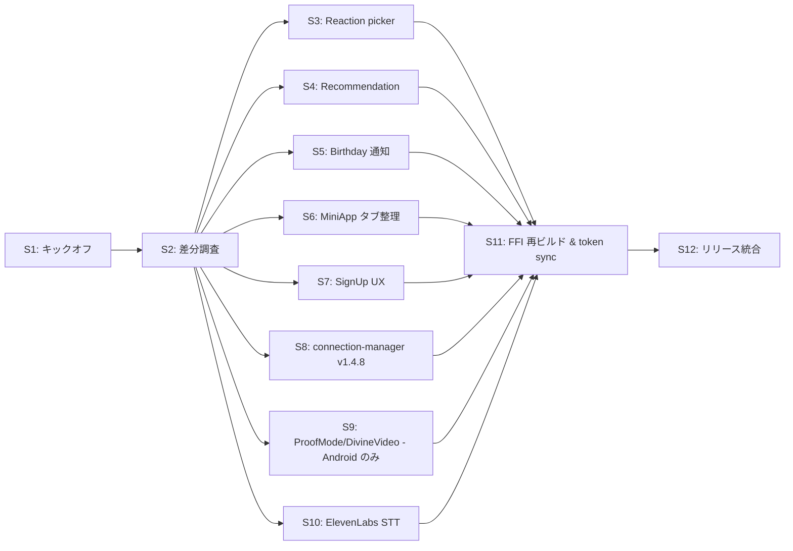

# Web → Native 同期 実行プラン

> Companion to [DESIGN.md](./DESIGN.md). Per-session prompts: [prompts/](./prompts/).

## 0. 全体像

12 セッションに分割。各セッションは独立で、別ターミナル / 別 Goose セッションで並行実行可。

ただし以下の依存関係に注意:

- **Session 1 (キックオフ)** が他全てに先行する (`STATUS.md` の初期化)
- **Session 11 (FFI まとめ)** は実装系セッション (3〜10) の後
- **Session 12 (リリース統合)** は最後

---

## 1. セッション一覧

| # | セッション | 対象プラットフォーム | 推定時間 | 依存 |
|---|---|---|---|---|
| 1 | キックオフ + ステータス初期化 | -- | 15min | -- |
| 2 | Web 差分調査 (各機能の Web 仕様確定) | -- (調査のみ) | 1h | S1 |
| 3 | Reaction picker: Unicode quick reaction 削除 | Android + iOS | 30min | S2 |
| 4 | Recommendation: アイコン無し除外 + Following 優先 | Android + iOS | 2h | S2 |
| 5 | Birthday 通知 + 相互フォロー Zap 通知 | Android + iOS | 2h | S2 |
| 6 | MiniApp タブ構成・順序を Web と一致させる | Android + iOS | 1.5h | S2 |
| 7 | SignUp: リージョン選択 + リレー検出強化 | Android + iOS | 2h | S2 |
| 8 | connection-manager v1.4.8 修正の Rust 反映調査 | Rust core (+ Android/iOS) | 1.5h | S2 |
| 9 | ProofMode / DivineVideoRecorder: Web → Android 差分反映 (iOS は対象外) | Android のみ | 2h | S2 |
| 10 | ElevenLabs STT (投稿/トークの音声入力) | Android + iOS | 3h | S2 |
| 11 | FFI 再ビルド + token sync + 動作確認 | Rust + Android + iOS | 1h | S3〜S10 |
| 12 | CHANGELOG / リリース準備 / マトリクス締め | -- | 1h | S11 |

合計推定: **17.5h** (1人作業換算、調整時間除く)

---

## 2. ブランチ戦略

- 親ブランチ: `sync/web-to-native-20260516`
- セッションごとにサブブランチ: `sync/web-to-native-20260516/sNN-<topic>`
  - 例: `sync/web-to-native-20260516/s03-reaction-picker`
- 各サブブランチを親へ PR (squash merge 推奨)
- 親ブランチを最終的に `main` へ PR

---

## 3. STATUS.md 運用

- セッション完了時、`docs/sync/STATUS.md` の該当行をチェック
- 部分完了 (Android 済 / iOS 未) の場合は分けてチェック
- 着手者・着手日を Markdown のテーブルに記入

---

## 4. ロールバック方針

- セッション単位でサブブランチに分けているため、問題発生時は当該サブブランチを破棄して再作成
- Rust FFI 変更は必ず Session 11 まとめで再ビルドし、それ以前のセッションでは FFI を変更しない (調査・設計のみ)

---

## 5. CI / 品質ゲート

| ゲート | コマンド | 必須セッション |
|---|---|---|
| Web tests | `npm run test` | S2, S4, S5, S8 |
| Web token check | `npm run tokens:check` | S6, S7, S11 |
| Android build | `cd android && ./gradlew assembleDebug` | S3〜S10, S11 |
| iOS build | `cd ios && xcodebuild -scheme NuruNuru -destination 'platform=iOS Simulator,name=iPhone 17' -skipPackagePluginValidation build` | S3〜S8, S10, S11 |
| iOS tests | `cd ios && xcodebuild ... test` | S11 |

---

## 6. 推奨並行実行パターン

下記は 3 並行ワーカーでの推奨スケジュール例:

| Worker | Day 1 | Day 2 | Day 3 |
|---|---|---|---|
| A (Android lead) | S1 → S2 | S3, S4 | S6, S9 |
| B (iOS lead) | (S2 共有) | S5 | S7 |
| C (FFI/Rust) | (S2 共有) | S8, S10 | S11, S12 |

---

## 7. 参考: Definition of Done (DoD) チェック (再掲)

- [ ] 該当 `prompts/session-N.md` の "Acceptance Criteria" を全て満たす
- [ ] `STATUS.md` を更新
- [ ] `CHANGELOG.md` に **(Android)** / **(iOS)** ラベル付きで記述
- [ ] スクリーンショットを `docs/sync/screenshots/sNN-*.png` に保存 (任意)
