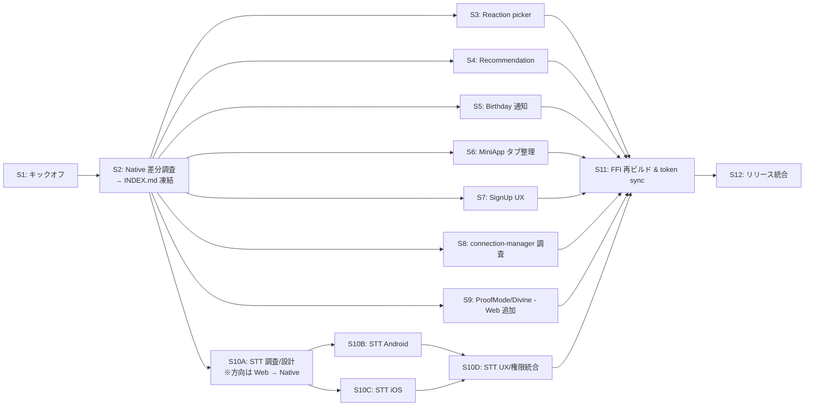

# Native → Web 同期 実行プラン

> Companion to [DESIGN.md](./DESIGN.md). Per-session prompts: [prompts/](./prompts/).
> Auxiliary: [CHECKLIST.md](./CHECKLIST.md), [TESTING.md](./TESTING.md), [REVIEW.md](./REVIEW.md), [PR_TEMPLATE.md](./PR_TEMPLATE.md), [research/INDEX.md](./research/INDEX.md).
>
> **方向**: Native (Android/iOS) が source of truth、Web を追従させる。
> ただし **STT (S10 系) は逆方向** (Web → Android/iOS) として扱う。

## 0. 全体像

15 セッション (S10 を A/B/C/D に細分化) に分割。各セッションは独立で、別ターミナル / 別 Goose セッションで並行実行可。

依存関係:

- **Session 1 (キックオフ)** が他全てに先行する
- **Session 2 (Native 差分調査)** が S3〜S10 に先行 → `research/INDEX.md` を凍結
- **Session 11 (FFI まとめ)** は実装系セッション (3〜10D) の後
- **Session 12 (リリース統合)** は最後

---

## 1. セッション一覧

| # | セッション | 方向 | 主な対象 | 推定時間 | 依存 |
|---|---|---|---|---|---|
| 1 | キックオフ + ステータス初期化 | -- | -- | 15min | -- |
| 2 | Native 差分調査 + `research/INDEX.md` 凍結 | -- (調査のみ) | Native ↔ Web 突合 | 1.5h | S1 |
| 3 | Reaction picker: Native 仕様に Web を寄せる | Native → Web | Web 中心 | 30min | S2 |
| 4 | Recommendation: アイコン無し除外 + Following 優先 | Native → Web | Web 中心 | 2h | S2 |
| 5 | Birthday 通知 + 相互フォロー Zap 通知 | Native → Web | Web 中心 (iOS は補完) | 2h | S2 |
| 6 | MiniApp タブ構成・順序を Native と一致させる | Native → Web | Web 中心 | 1.5h | S2 |
| 7 | SignUp: リージョン選択 + リレー検出強化 | Native → Web | Web (iOS も SignUpView 補完) | 2h | S2 |
| 8 | connection-manager v1.4.8 修正の Rust 反映調査 | -- (調査のみ) | Rust core | 1.5h | S2 |
| 9 | ProofMode / DivineVideoRecorder: Android → Web (iOS 対象外) | Android → Web | Web 中心 | 2h | S2 |
| 10A | STT: API 仕様・キー保管・WS フォーマット設計 | -- (設計のみ) | Web → Native の方向確認 | 1h | S2 |
| 10B | STT: Android 実装 (`ElevenLabsSttService.kt` + UI 配線) | **Web → Android** | Android | 2.5h | S10A |
| 10C | STT: iOS 実装 (`ElevenLabsSttService.swift` + UI 配線) | **Web → iOS** | iOS | 2.5h | S10A |
| 10D | STT: UX / 権限 / エラー処理統合 (両 OS) | Web → Native | Android + iOS | 1.5h | S10B, S10C |
| 11 | FFI 再ビルド + token sync + 動作確認 | -- | Rust + Android + iOS + Web | 1h | S3〜S10D |
| 12 | CHANGELOG / リリース準備 / マトリクス締め | -- | -- | 1h | S11 |

合計推定: **22.5h** (1人作業換算、調整時間除く)

> 旧 Session 10 (3h で全 OS 統合) は STT の作業範囲が大きすぎたため A/B/C/D に分割 (REVIEW.md §2)。

---

## 2. ブランチ戦略

- 親ブランチ: `sync/native-to-web-20260516`
- セッションごとにサブブランチ: `sync/native-to-web-20260516/sNN-<topic>`
  - 例: `sync/native-to-web-20260516/s03-reaction-picker`
  - S10 系は: `s10a-stt-design`, `s10b-stt-android`, `s10c-stt-ios`, `s10d-stt-ux`
- 各サブブランチを親へ PR (squash merge 推奨)
- 親ブランチを最終的に `main` へ PR

### 2.1 競合回避

複数セッションが同一ファイルを触るパターンは [CHECKLIST.md §2](./CHECKLIST.md) のマトリクスを参照し、**直列化** する。

代表例:
- Web `components/MiniAppTab.js`: **S6 → S10D** の順
- Web `components/SignUpModal.js`: 単独 (S7)
- Web `components/TimelineTab.js`: **S4 → S5** の順
- Native 側 `SettingsScreen.kt` / `SettingsView.swift` (STT 設定追加時): **S6 → S10D**
- Native 側 `AppPreferences.kt` / `AppPreferences.swift` (STT 設定追加時): **S10D 単独**

---

## 3. STATUS.md 運用

- セッション完了時、`docs/sync/STATUS.md` の該当行を更新
- 部分完了 (Web 済 / iOS 未) の場合は分けてチェック
- 着手者・着手日を Markdown のテーブルに記入
- ブロッカー発生時は STATUS.md「ブロッカー」節へ追記し、必要なら新セッションを切る

---

## 4. ロールバック方針

- セッション単位でサブブランチに分けているため、問題発生時は当該サブブランチを破棄して再作成
- Rust FFI 変更は **必ず Session 11 まとめで再ビルド** し、それ以前のセッションでは FFI を変更しない (調査・設計のみ)

---

## 5. CI / 品質ゲート

| ゲート | コマンド | 必須セッション |
|---|---|---|
| Web tests | `npm run test` | S3〜S7, S9, S10D, S11 (Web 変更を伴うすべて) |
| Web build | `npm run build` | S3〜S9, S10D, S11 |
| Web token check | `npm run tokens:check` | S6, S7, S11 |
| Android build | `cd android && ./gradlew assembleDebug` | S10B, S11 |
| Android tests | `cd android && ./gradlew test` | S10B |
| iOS build | `cd ios && xcodebuild -scheme NuruNuru -destination 'platform=iOS Simulator,name=iPhone 17' -skipPackagePluginValidation build` | S10C, S10D, S11 |
| iOS tests | `xcodebuild ... test` | S10C, S11 |
| FFI bindings | `bash bindgen/gen_kotlin.sh` + cross-compile | S11 (FFI 変更時のみ) |

---

## 6. 実機検証必須項目

[CHECKLIST.md §1](./CHECKLIST.md) を参照。代表項目を再掲:

| セッション | 実機必須内容 | プラットフォーム |
|---|---|---|
| S5 | Birthday / Zap 通知のフォアグラウンド表示, Lightning 受信 | Web (PWA push) + Native 動作確認 |
| S7 | NIP-05 / 位置情報からの geohash 推定 | Web ブラウザ + Native (既動作) |
| S9 | ProofMode 録画 (Android で既動作) → Web ブラウザ MediaRecorder で同等 | Android (既) + Web (新) |
| S10B/C/D | マイク + ElevenLabs STT WS streaming, BT ヘッドセット | Android + iOS (Web は既動作) |
| S11 | NIP-EE (MLS) Talk 送受信 | Android + iOS (Web は別途調査) |
| S12 | 配布: Web (Vercel) / TestFlight / Play Internal | All |

---

## 7. 推奨並行実行パターン

3 並行ワーカーでの推奨スケジュール例:

| Worker | Day 1 | Day 2 | Day 3 | Day 4 |
|---|---|---|---|---|
| A (Web lead) | S1 → S2 (共有) | S3, S4 | S5, S6 | S7, S9 |
| B (Native lead) | (S2 共有) | S10B (STT Android) | S10C (STT iOS) | S10D, S11 |
| C (FFI/Rust) | (S2 共有) | S8 | S10A (設計) | S11, S12 |

---

## 8. 参照: Definition of Done (DoD)

[CHECKLIST.md §3](./CHECKLIST.md) を必ず確認。要点を再掲:

- [ ] 該当 `prompts/session-NN.md` の Acceptance Criteria を全て満たす
- [ ] AGENTS.md 制約遵守
- [ ] `STATUS.md` 更新
- [ ] `CHANGELOG.md` に **(Web)** / **(Android)** / **(iOS)** タグ付きで記述
- [ ] テスト最低 1 ケース追加 ([TESTING.md](./TESTING.md))
- [ ] スクリーンショット (UI 変更時) を `docs/sync/screenshots/sNN-*.png` に保存
- [ ] PR description に [PR_TEMPLATE.md](./PR_TEMPLATE.md) を流用
